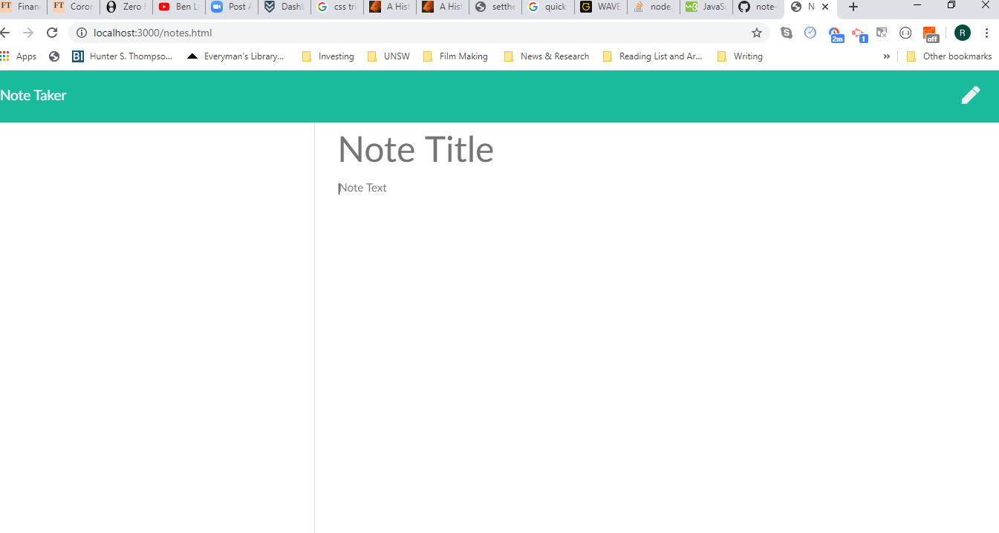
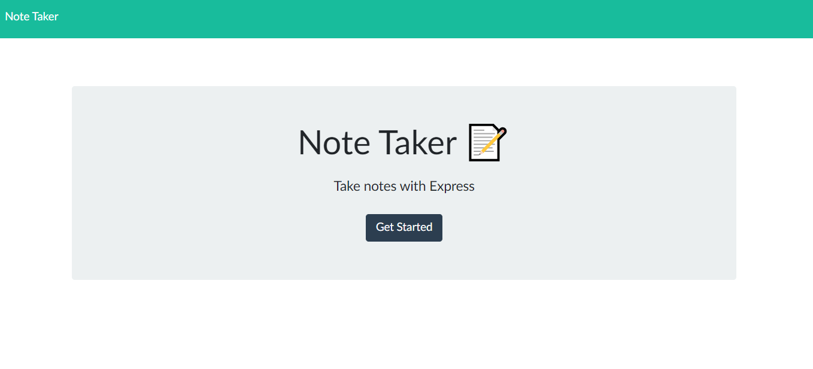

# Note Taker

## Description
This is an app that uses HTML, CSS, JavaScript and Node.js
It allows people to store notes and delete them. 
There is a JSON file for holding information. 

## Screenshot 

## Link to Website

https://rhysrushton.github.io/homework11notetaker/public/index

## User Story 

AS A user, I want to be able to write and save notes

I WANT to be able to delete notes I've written before

SO THAT I can organize my thoughts and keep track of tasks I need to complete